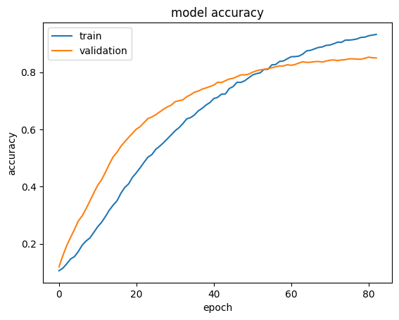
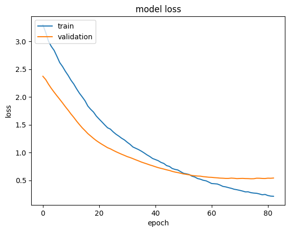
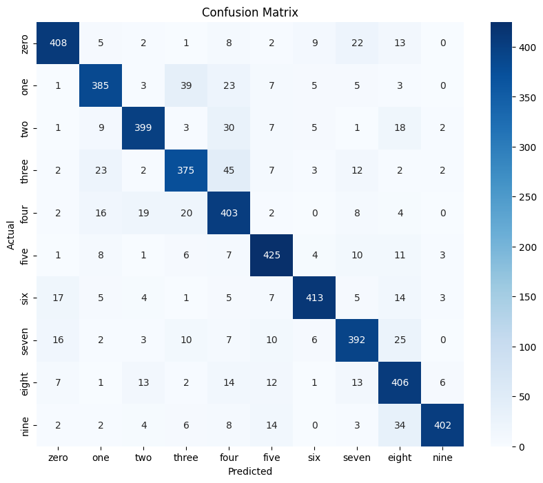

# Speech Classification from 0 to 9 with ANN Model

## Table of Contents

- [Project Overview](#project-overview)
- [Dataset](#dataset)
- [Installation](#installation)
- [Preprocessing](#preprocessing)
- [Model Architecture](#model-architecture)
- [Training](#training)
- [Evaluation](#evaluation)
- [Results](#results)
- [License](#license)

## Project Overview

This project focuses on building a neural network to classify spoken digits (0 to 9) based on audio data. Using a Sequential Artificial Neural Network (ANN), the model takes pre-processed audio features and learns to classify each digit. The project includes essential visualizations such as learning curves and a confusion matrix to evaluate model performance.

## Dataset

The dataset used in this project consists of pre-labeled audio files where each recording corresponds to a spoken digit between 0 and 9. Common datasets for this task include [Google’s Speech Commands dataset](https://www.kaggle.com/datasets/neehakurelli/google-speech-commands) or [Free Spoken Digit Dataset (FSDD)](https://www.kaggle.com/datasets/jackvial/freespokendigitsdataset/data). Each audio file is converted into a suitable feature format (e.g., MFCC, Mel spectrogram) for input into the neural network.

## Installation

To set up the project environment, first clone the repository and install the required packages:

```bash
git clone https://github.com/PeterPHF/Speech-Command-Recognition.git
cd Speech-Command-Recognition
pip install -r requirements.txt
```

## Preprocessing

1. Audio Feature Extraction: Each audio file is pre-processed into a feature vector. Common feature extraction techniques used are:

- MFCC (Mel Frequency Cepstral Coefficients)
- Mel Spectrogram
- Zero-Crossing Rate, Spectral Roll-off, etc.

2. Normalization: The feature vectors are normalized to improve training efficiency and convergence.

3. Splitting the Data: The data is split into training, validation, and testing sets for unbiased evaluation of the model.

## Model Architecture

This project uses a Sequential ANN with Dense layers for classification. The architecture may look like this:

- Input Layer: Accepts feature vectors.
- Hidden Layers: Multiple Dense layers with ReLU activation.
- Output Layer: Softmax activation with 10 neurons for the 10 classes (digits 0–9).

```python
from tensorflow.keras.models import Sequential
from tensorflow.keras.layers import Dense, Dropout, BatchNormalization

model = Sequential([
    BatchNormalization(),
    Dense(1024, input_shape=(4000,), activation='relu'),
    BatchNormalization(),
    Dropout(0.3),
    Dense(1024, activation='relu'),
    BatchNormalization(),
    Dropout(0.3),
    Dense(512, activation='relu'),
    BatchNormalization(),
    Dropout(0.3),
    Dense(256, activation='relu'),
    BatchNormalization(),
    Dropout(0.3),
    Dense(256, activation='relu'),
    BatchNormalization(),
    Dropout(0.3),
    Dense(128, activation='relu'),
    BatchNormalization(),
    Dropout(0.3),
    Dense(10, activation='softmax')

model.compile(loss='categorical_crossentropy', optimizer=Adam(learning_rate=0.00002), metrics=['accuracy'])

])
```

## Training

To train the model, run:

```python
batch_size = 64
early_stopping = tf.keras.callbacks.EarlyStopping(monitor='val_loss', patience=8, verbose=1, restore_best_weights=True)
checkpointer = tf.keras.callbacks.ModelCheckpoint(filepath='/kaggle/working/audio_classification.keras',verbose=1, save_best_only=True)

history = model.fit(X_train, y_train, epochs=200, validation_split=0.2, callbacks = [early_stopping, checkpointer], batch_size=batch_size)
```

Learning rate, batch size, and the number of epochs can be adjusted for optimal performance. Early stopping is also implemented to avoid overfitting.

## Evaluation

After training, the model is evaluated on the test dataset. The evaluation metrics include:

- Accuracy: Overall classification accuracy.
- Confusion Matrix: Visual representation of true vs. predicted labels.
- Learning Curves: Plots of training and validation accuracy/loss over epochs.

## Results

1. Learning Curves: Learning curves plot training and validation accuracy/loss, helping to assess model performance and diagnose potential overfitting or underfitting.

```python
plt.plot(history.history['accuracy'])
plt.plot(history.history['val_accuracy'])
plt.title('model accuracy')
plt.ylabel('accuracy')
plt.xlabel('epoch')
plt.legend(['train', 'validation'], loc='upper left')
plt.show()


plt.plot(history.history['loss'])
plt.plot(history.history['val_loss'])
plt.title('model loss')
plt.ylabel('loss')
plt.xlabel('epoch')
plt.legend(['train', 'validation'], loc='upper left')
plt.show()
```




2. Confusion Matrix: The confusion matrix provides detailed insights into model performance by visualizing the distribution of correct and incorrect predictions across all classes.

```python
y_pred = model.predict(X_test)
y_pred_classes = np.argmax(y_pred, axis=1)
y_true = np.argmax(y_test, axis=1)
cm = confusion_matrix(y_true, y_pred_classes)
plt.figure(figsize=(10, 8))
sns.heatmap(cm, annot=True, fmt='d', cmap='Blues', xticklabels=CLASSES, yticklabels=CLASSES)
plt.xlabel('Predicted')
plt.ylabel('Actual')
plt.title('Confusion Matrix')
plt.show()
```



## License

This project is licensed under the MIT License.